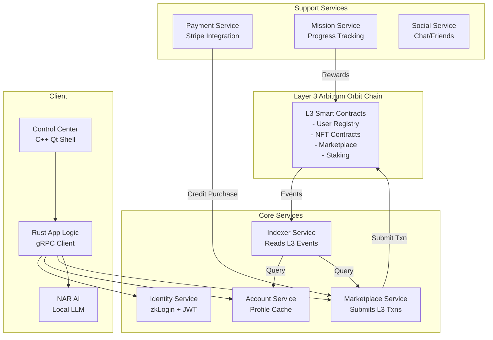

Task 0.3: Comprehensive Schema & API Contract Definition
(Finalized, Reviewed, Secure by Design, Versioned - Incorporating Full Lore/Mechanics, Security Validations, Dual-Mode Fields, & L3 Architecture APIs - Principles B, H, N, R)
Technical Reference
Protocol Buffers v3 Language Guide
gRPC Documentation
OpenAPI Specification v3
cbindgen Documentation (for C-FFI generation)
CXX-Qt Documentation (for Rust-QML FFI)
BUNKERVERSE Platform Overview V2.4 (for Lore/Mechanics definitions)
Context/Problem Statement
With the technology stack chosen in Task 0.2, we must now define the immutable language that all our components will use to communicate. This includes the data structures for on-chain state, the events emitted by our L3 smart contracts, the service-to-service gRPC APIs, and the Foreign Function Interfaces (FFIs) to the client. Unstable or poorly designed API contracts are a primary source of bugs, security flaws, and costly refactoring. This task ensures we establish a stable, secure, and versioned set of contracts before any significant implementation begins.
Measurable Objectives
All .proto files for gRPC services are finalized, versioned to v0.1, and peer-reviewed.
The conceptual data structures and events for the L3 smart contracts are finalized in Protobuf format, serving as the blueprint for both the smart contracts and the Indexer.
The C-FFI header for the NAR library is finalized and generated.
The Rust-QML FFI contract for the client is conceptually defined and security-reviewed.
A formal security review and threat model report exists for every key API and FFI.
Implementation Guidance
Action: Define, finalize, version (v0.1), and conduct rigorous security design reviews and threat modeling for all data schemas (representing the state within L3 Smart Contracts, Protocol Buffer messages for events and inter-service communication) and API contracts. This includes gRPC for Rust backend services (interfacing with the L3 sequencer and Indexer), the C-FFI header for the Rust NAR library, and the Rust-QML FFI definitions exposed via CXX-Qt for the Control Center Client. All schemas and APIs must be secure by design, fully support all lore and mechanics detailed in BUNKERVERSE Platform Overview V2.4, and correctly accommodate the dual-mode architecture. This means including fields or entire message structures that might be used differently or only become active in Mode On-Chain (e.g., fields for crypto addresses, NTC staking details), ensuring they are present in the schemas even if their logic is stubbed or disabled in the MVE's implementation.

### Concrete Schema Examples

#### Example 1: AgentChainStateProto with Dual-Mode Fields
```protobuf
syntax = "proto3";
package bunkerverse.core.v1;

message AgentChainStateProto {
  // Core fields - always active
  string player_id = 1; // UUID v4, validated: ^[0-9a-f]{8}-[0-9a-f]{4}-[0-9a-f]{4}-[0-9a-f]{4}-[0-9a-f]{12}$
  BalancesProto balances = 2;
  ActiveBunkerguardDataProto active_bunkerguard = 3;
  map<string, repeated string> owned_nft_ids_by_type = 4; // key: ItemTypeProto name
  
  // On-chain fields - active in MVE on L3
  NtcStakingDetailsProto ntc_staking = 5; // Active on L3 chain
  CryptoAddressesProto crypto_addresses = 6; // Player's L3 wallet addresses
  
  // Metadata
  uint32 schema_version = 7; // Starting at 1, for migration handling
  int64 last_updated_timestamp = 8; // Unix timestamp, validated: > 1609459200 (2021+)
}

message BalancesProto {
  uint64 xp = 1; // Validated: <= MAX_XP (1000000000)
  uint64 ntc_balance = 2; // In smallest unit (wei), validated: <= MAX_SUPPLY
  uint64 credits_balance = 3; // Fiat credits for purchases, active in MVE
}
```

#### Example 2: Service Interaction with Error Handling
```protobuf
message GetPlayerProfileRequest {
  string player_id = 1; // Required, validated as UUID
  bool include_inventory = 2; // Optional performance optimization
  bool include_transaction_history = 3; // From L3 chain events
}

message GetPlayerProfileResponse {
  oneof result {
    PlayerProfileProto profile = 1;
    ErrorResponse error = 2;
  }
}

message ErrorResponse {
  enum ErrorCode {
    UNKNOWN = 0;
    NOT_FOUND = 1;
    UNAUTHORIZED = 2;
    INVALID_INPUT = 3;
    FEATURE_DISABLED = 4; // For on-chain features in MVE
    RATE_LIMITED = 5;
  }
  ErrorCode code = 1;
  string message = 2; // User-safe message
  string trace_id = 3; // For debugging, links to logs
}
```

### Security Review Checklist

#### Input Validation Checklist
- [ ] **UUID Validation**: All player_id fields validate format: `^[0-9a-f]{8}-[0-9a-f]{4}-[0-9a-f]{4}-[0-9a-f]{4}-[0-9a-f]{12}$`
- [ ] **Numeric Bounds**: All uint64 fields have MAX values defined and validated
- [ ] **String Length**: All string fields have max length constraints (e.g., username <= 32 chars)
- [ ] **Enum Validation**: All enum fields reject unknown values with specific error codes
- [ ] **Timestamp Validation**: All timestamps validated as reasonable (> 2021, < current_time + 1 day)
- [ ] **Address Validation**: Ethereum addresses validated via regex: `^0x[a-fA-F0-9]{40}$`
- [ ] **Signature Validation**: All signatures are 65 bytes (r: 32, s: 32, v: 1)

#### API Security Checklist
- [ ] **Authentication Required**: All endpoints except health checks require JWT/session
- [ ] **Rate Limiting**: All public endpoints have rate limits defined (e.g., 100 req/min)
- [ ] **Authorization Checks**: Player can only modify their own data
- [ ] **Admin Endpoints**: Separate admin service with mTLS authentication
- [ ] **Error Messages**: No sensitive data in error responses (no stack traces, internal IPs)
- [ ] **Trace IDs**: All responses include trace_id for debugging without exposing internals
- [ ] **CORS Headers**: Properly configured for Control Center Client only

#### L3 Smart Contract Security
- [ ] **Reentrancy Guards**: All state-changing functions have reentrancy protection
- [ ] **Integer Overflow**: Using Rust's checked arithmetic in Stylus contracts
- [ ] **Access Control**: Role-based permissions for admin functions
- [ ] **Upgrade Safety**: Proxy pattern with time-locked upgrades
- [ ] **Event Emission**: All state changes emit events for indexing
- [ ] **Gas Limits**: Functions have predictable gas usage < 10M gas

### Service Dependency Mapping



### Data Flow Examples

#### NFT Purchase Flow
1. Client -> Marketplace Service: `PurchaseNftRequest`
2. Marketplace Service -> Payment Service: Verify credits
3. Marketplace Service -> L3 Chain: Submit purchase transaction
4. L3 Chain -> Events: Emit `NftPurchasedEvent`
5. Indexer -> Database: Update ownership records
6. Account Service -> Client: Push update via WebSocket

#### Mission Completion Flow
1. Client -> Mission Service: `CompleteMissionRequest`
2. Mission Service: Validate completion criteria
3. Mission Service -> L3 Chain: Submit reward transaction
4. L3 Chain -> Events: Emit `MissionCompletedEvent`, `XpAwardedEvent`
5. Indexer -> Database: Update player stats
6. Account Service -> Client: Push XP update

Schema and API Contract Development:
Finalize core Rust enums and structs (e.g., PlayerId, NftId, Timestamp, error types) and corresponding Protobuf messages for shared concepts.
Define Protobuf enums for all canonical game mechanics:
BunkerClassProto: EXPLORER, PATHFINDER, CYBERMANCER, VANGUARD, ENFORCER, SCAVENGER, STALKER, DISRUPTOR, CODEBREAKER, OVERLORD, BREACHER, RECLAIMER.
ClassAffiliationProto: LOYAL, CORRUPT, NEUTRAL.
NexusTypeProto: HOME, COMMUNITY, MINI_GAMES, FORUM, MARKETPLACE.
ItemRarityProto: STANDARD, OPTIMIZED, ADVANCED, SUPREME, ECHELON, ETERNAL.
ItemConditionProto: PRIME_STATE, NEW_STATE, USED_STATE, BROKEN_STATE.
ItemTypeProto: HEAD, TORSO, GEAR, ACCESSORY, PERK, BADGE, BUNKERGUARD_ROBOT, ROBOT_ITEM, COSMETIC_SKIN.
StatCategoryProto: COMBAT, MOBILITY, SURVIVABILITY, SENSORS.
Define Protobuf messages for core data structures like CoreStatsProto (containing all 12 sub-stats and 4 category averages), NftIdentifierProto.
Finalize AgentChainStateProto: The complete state of a player's account as it will be stored within the core L3 smart contract, including player_id, balances_proto (XP, NTC balance), active_bunkerguard_data_proto, owned_nft_ids_by_type_map, ntc_staking_details_proto (for Mode On-Chain, inactive in MVE), crypto_addresses_proto (for Mode On-Chain, inactive in MVE).
Finalize ActiveBunkerguardDataProto: robot_id_opt (linked BunkerguardRobot NFT ID), level, current_class_opt (BunkerClassProto), current_affiliation (ClassAffiliationProto), final_stats (CoreStatsProto), equipped_items map.
Finalize NftDetailsProto: The canonical, immutable properties of an NFT: item_rarity, item_type, base_stat_boosts (CoreStatsProto), class_affinities, trait_affiliation, construct_origin, metadata_pointer_uri (CID for IPFS metadata).
Finalize NftMutableStateProto: The mutable properties of an NFT: current_owner_id, current_condition, is_soulbound, market_status_opt.
Finalize CanonicalEventProto: A oneof wrapper for all specific event payloads emitted by the L3 smart contracts (e.g., UserRegisteredPayloadProto, NftMintedPayloadProto (containing full NftDetailsProto), ItemEquippedPayloadProto, RobotStatsUpdatedPayloadProto, NtcStakingInitiatedPayloadProto (Mode On-Chain)). All payloads must be fully defined to support all lore/mechanics.
SubmitTransaction(TransactionRequestProto) returns (TransactionAcknowledgementProto): For submitting signed transactions to the L3 sequencer. TransactionRequestProto includes the serialized transaction payload and signature.
GetTransactionReceipt(GetTransactionReceiptRequest) returns (TransactionReceiptProto): A standard endpoint to query the status of a submitted transaction.
GetPlayerProfile(PlayerProfileRequest) returns (PlayerProfileResponseProto): PlayerProfileResponseProto to include full ActiveBunkerguardDataProto, XP, NTC balance, Credits balance (Mode On-Chain, zero for MVE).
GetNftDetails(NftDetailsRequest) returns (NftDetailsResponseProto): To include full NftDetailsProto and NftMutableStateProto.
GetMarketListings(MarketListingsRequest) returns (MarketListingsResponse): With filters for all NftDetailsProto attributes.
GetPlayerOwnedNfts(PlayerOwnedNftsRequest) returns (PlayerOwnedNftsResponse).
GetAIAgentInputDataContext(AIAgentInputDataContextRequest) returns (AIAgentInputDataContextProto).
GetTransactionHistory(TransactionHistoryRequest) returns (TransactionHistoryResponse).
Finalize all service APIs as listed in the original document (Identity, Account, Marketplace, Payment, Mission, Social, AI Data, Feedback). The ExecuteTradeIntent in the Marketplace Service will now be understood as constructing a transaction to be submitted to the L3, not a custom NLS.
Finalize C-compatible structs for NarConfigC, GenerateParamsC.
Define extern "C" function signatures: init_nar_engine_ffi, generate_text_nar_ffi, free_nar_generated_text_ffi, shutdown_nar_engine_ffi, get_nar_status_ffi.
Define NarResultCode enum and NarStatusReportC struct.
Identify all Rust structs, enums, and functions in /client/rust-app-logic/ that need to be accessible from QML.
Use CXX-Qt macros (#[cxx_qt::qobject], #[cxx_qt::qproperty], #[cxx_qt::qinvokable]) to define the FFI bridge. This includes structs for UI data, functions to trigger backend calls and on-chain actions, and signals for state updates.
0.3.a. Data Migration Considerations (Principle N):
All Protobuf messages intended for persistence in L3 smart contract events (e.g., UserRegisteredPayloadProto) will include a schema_version: u32 field, starting at 1.
The docs/SMART_CONTRACT_EVOLUTION_PLAN.md will be created, outlining the strategy for handling schema changes, likely involving proxy patterns and upgradeability.
Indexer will need strategies for re-indexing or transforming data if L3 smart contract event schemas it consumes change significantly. This might involve blue/green deployments for the Indexer or offline re-indexing jobs.
This strategy must also consider how schema changes affect the disabled Mode On-Chain fields.
Input Validation in Schemas and API Handlers:
For Protobuf messages: Utilize field validation options where possible to define constraints.
For all API handlers (gRPC, FFI): Implement explicit, robust input validation logic at the beginning of each handler. This includes checking for nulls, validating ranges, lengths, formats, and enums, validating IDs, and sanitizing string inputs.
Document any complex validation rules that cannot be expressed in Protobuf field options.
0.3.b. Cross-Component API/FFI Formal Review Meetings & Sign-off (with Mandatory Security Reviewer):
Action: Schedule and conduct formal, minuted review meetings for the NAR C-FFI, the Client Rust-QML FFI, and all key gRPC service contracts.
Attendees: Relevant leads, Lead Architect, Security Lead (mandatory attendance and sign-off), QA Lead.
Focus of Reviews: Clarity, Correctness, Security Implications (Data Exposure, AuthN/AuthZ, Input Validation Coverage), FFI Safety (Memory, Panic Safety), Testability, and Dual-Mode Field Handling.
Outcome: Formal sign-off documented in progress_phase_0.md.
0.3.c. Security Review & Threat Modeling of API Contracts (Deep Dive - Principle R):
Action: Perform dedicated security design review and focused threat modeling (e.g., STRIDE) for all finalized API contracts.
Specific Checks: Re-verify input validation. Check for data exposure and least privilege. Confirm authorization logic is sound. Ensure error handling doesn't leak information. Re-verify FFI boundaries. Check for idempotency markers where needed (e.g., in requests that will become L3 transactions). Assess dual-mode security.
Documentation & Validation Tools:
Generate versioned HTML documentation from Protobuf and OpenAPI specs.
Use Protobuf linting tools (buf lint) to enforce style.
Ensure Rust API documentation for CXX-Qt clearly indicates what is exposed to QML.
Update docs/progress_logs/progress_phase_0.md:
Detail the final agreed-upon schemas and API contracts.
Crucially, document the outcomes of the API security reviews and threat modeling sessions for each contract. List identified risks and detail how they were mitigated in the API design.
Log formal sign-offs from the API review meetings.
Design Rationale
An "API-first" approach decouples teams and allows for parallel development. Finalizing and rigorously reviewing contracts before implementation prevents fundamental architectural errors. Hardening the FFI boundaries at the design stage is a critical security measure. The conceptual schemas now directly inform the design of the L3 smart contracts, creating a unified data model from the canonical on-chain store to the off-chain services.
Operational Considerations
These v0.1 contracts will be treated as stable. Any future breaking changes will require a new version (e.g., v2/service.proto) and a formal ADR. Smart contract upgradeability will be managed via a proxy pattern, with upgrades controlled by a multi-sig or future DAO, a process to be detailed in a later phase.
Verification & Validation Criteria
Formal sign-off documents/PR approvals exist for all API contracts.
Static analysis reports (Protobuf lint) are clean.
A documented Security Review & Threat Model Report exists for all key APIs and FFIs.
Testing Methodologies
N/A (Design and review phase).
Version Control Strategy
Branching: All finalized .proto files, FFI headers, and conceptual Rust/QML FFI definitions will be merged into the develop branch.
Commits: The Git Commit message for this task will be exactly as specified.
Security Audit & Compliance Checkpoints
This entire task is a critical security checkpoint, with mandatory sign-off from the Security Lead on all contracts and threat models before the task can be marked as complete.
ReviewedBy: API Review Board (comprising relevant Tech Leads, Lead Architect), Security Lead, Client Lead (for CXX-Qt FFI).
ReviewOutcome: Secure API Contracts v0.1 Approved (Full Lore/Mechanics, Dual-Mode Ready, CXX-Qt FFI Secure, Validated).
ValidationMethod: Formal sign-off documents/PR approvals for API contracts. Static analysis reports (Protobuf lint). Documented Security Review & Threat Model Report for all key APIs and FFIs.
Git Commit here: @https://github.com/emiliancristea/bunkerverse-platform.git "Phase 0.3: Finalized & Security-Reviewed Schemas & API Contracts v0.1 (Full Lore/Mechanics, Dual-Mode Ready, Secure by Design incl. CXX-Qt FFI, Validated)." @Phase0/