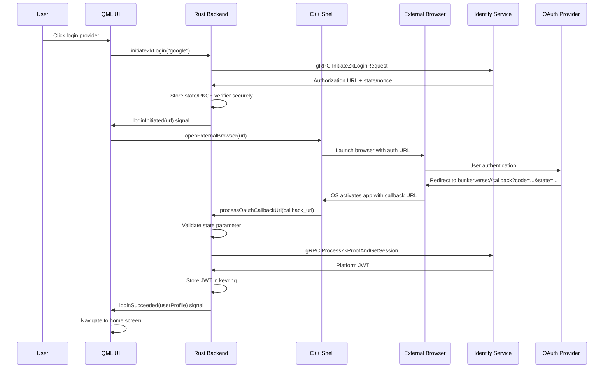
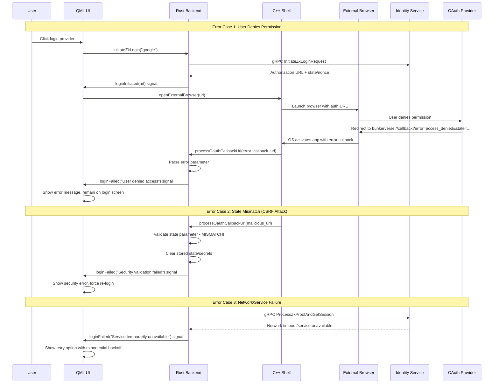

Task 1.8: Control Center Client - Core Authentication
(Full Secure zkLogin Flow with Functional Rust Identity Service via Rust App Logic and CXX-Qt/QML UI - Principles H, J, K, M, P, R)
Technical Reference
* CXX-Qt and QML Documentation
* keyring Rust crate documentation
* Platform-specific guides for custom URL scheme registration (Windows Registry, Apple Info.plist, Linux .desktop files)
* Finalized v0.1 identity_service.proto API Contract
* docs/ui/CLIENT_QML_UI_DEFINITION_MVE_V0.1.md

Library/Tool Versions:
| Library/Tool | Version | Notes |
|--------------|---------|-------|
| Qt SDK | 6.9.2 (MSVC 2022 64-bit) | Path: D:\DOCUMENTS\Qt\6.9.2\msvc2022_64 |
| cxx-qt Crate | 0.7.2 | The crate aims to support all Qt 6 versions; pinned for stability. |
| rustc | 1.80.0 (Stable) | Pinned via rust-toolchain.toml. |
Context/Problem Statement
With a functional Identity Service (Task 1.1) and a stubbed client framework (Tasks 0.8, 0.9) in place, we must now implement the complete, end-to-end user authentication flow. This is the most critical user journey in the MVE, as it's the first interaction every user will have. It requires tight, secure orchestration between the QML frontend, the client's core Rust logic, the native C++ shell, and the backend Identity Service to deliver the seamless and secure "On-Chain in Substance, Off-Chain in Appearance" experience.
Measurable Objectives
* The LoginScreen.qml is fully functional, displaying dynamic provider options from the Identity Service.
* The client can successfully orchestrate the full OAuth redirect flow using the system's default external browser.
* The client correctly handles the custom URL scheme callback, validates all security parameters (e.g., CSRF state), and securely obtains a platform JWT.
* The received JWT is securely stored for session persistence using the native OS credential manager.
* The entire flow is validated by comprehensive end-to-end (E2E) tests.
Implementation Guidance
Action: Implement the complete, security-hardened zkLogin authentication flow within the Control Center Client. This involves the QML UI triggering actions, the Rust Application Logic handling the entire flow orchestration (communicating securely with the functional Rust Identity Service), and the C++ Shell providing the native application container and browser integration for the OAuth redirect loop.
* QML Frontend (/client/qml-ui/auth/):
o LoginScreen.qml:
* Displays login options. Fetches the list of available OAuth providers by calling a #[cxx_qt::qinvokable] method on the rustBackend object (e.g., rustBackend.getLoginProviders()).
* Renders buttons for each provider (e.g., Google, Apple, Twitch).
* When a user clicks a provider button, it invokes another Rust method (e.g., rustBackend.initiateZkLogin("google")).
o State Handling: The QML UI will react to signals from the Rust backend, such as loginInitiated(url), loginInProgress(), loginSucceeded(userProfile), loginFailed(errorMessage).
o OAuth Redirect Handling: When the loginInitiated(url) signal is received, the QML UI will message the C++ Shell (via a CXX-Qt signal from Rust) to open the provided URL in the user's default external web browser. This is more secure than using an embedded web view.
* Rust Application Logic (/client/rust-app-logic/src/auth/zklogin_handler.rs - Secure Implementation):
* This Rust module, part of the rustBackend QObject, orchestrates the entire client-side zkLogin flow.
* #[cxx_qt::qinvokable] async fn initiate_zk_login(&self, provider_id: &str):
* Calls the functional Rust Identity Service's gRPC InitiateZkLoginRequest endpoint.
* Receives the authorization URL.
* Emits a QML signal loginInitiated(url) containing this URL.
* Securely stores the necessary state (e.g., state parameter, nonce, PKCE verifier) in memory for the subsequent callback step.
* Custom URL Scheme Handler Logic:
* The C++ Shell passes the full callback URL string to a dedicated method in the Rust Application Logic (e.g., rustBackend.processOauthCallbackUrl(url)).
* #[cxx_qt::qinvokable] async fn process_oauth_callback_url(&self, url: &str):
* Parses the authorization code and state from the received URL.
* Validates the received state against the value stored in memory to prevent Cross-Site Request Forgery (XSRF).
* Securely passes the authorization code and other necessary data to the Rust Identity Service via its gRPC ProcessZkProofAndGetSession endpoint.
* Receives the platform session JWT from the Identity Service.
* Secure JWT Storage: Securely store the received JWT for persistence across app restarts, using a Rust crate like keyring which abstracts over Windows Credential Manager, macOS Keychain, and Linux Secret Service. Do not store the JWT in plaintext files or unencrypted local storage.
* After storing the JWT, emit a loginSucceeded(userProfile) signal (potentially fetching the initial profile from the Account service first).
* Handle all potential errors by emitting loginFailed(errorMessage) signals.

## Complete OAuth Flow Sequence Diagrams

### Successful OAuth Flow


### Error State Handling


## Platform-Specific URL Scheme Registration

### Windows Implementation
```cpp
// windows_url_handler.cpp
#include <windows.h>
#include <QSettings>

class WindowsUrlHandler {
public:
    static bool registerUrlScheme() {
        QSettings registry("HKEY_CURRENT_USER\\Software\\Classes", QSettings::NativeFormat);
        
        // Register the bunkerverse protocol
        registry.setValue("bunkerverse/Default", "Bunkerverse Protocol");
        registry.setValue("bunkerverse/URL Protocol", "");
        
        QString appPath = QCoreApplication::applicationFilePath();
        registry.setValue("bunkerverse/shell/open/command/Default", 
                         QString("\"%1\" \"%2\"").arg(appPath, "%1"));
        
        return registry.status() == QSettings::NoError;
    }
    
    static bool isRegistered() {
        QSettings registry("HKEY_CURRENT_USER\\Software\\Classes\\bunkerverse", 
                          QSettings::NativeFormat);
        return registry.contains("URL Protocol");
    }
};
```

### macOS Implementation
```cpp
// macos_url_handler.mm
#import <Cocoa/Cocoa.h>
#include "macos_url_handler.h"

@interface BunkerverseUrlHandler : NSObject
+ (void)registerUrlScheme;
+ (BOOL)isRegistered;
@end

@implementation BunkerverseUrlHandler

+ (void)registerUrlScheme {
    // Register with Launch Services
    NSString *bundleId = [[NSBundle mainBundle] bundleIdentifier];
    
    LSSetDefaultHandlerForURLScheme(CFSTR("bunkerverse"), 
                                   (__bridge CFStringRef)bundleId);
}

+ (BOOL)isRegistered {
    CFStringRef handlerId = LSCopyDefaultHandlerForURLScheme(CFSTR("bunkerverse"));
    if (handlerId) {
        NSString *currentHandler = (__bridge_transfer NSString*)handlerId;
        NSString *bundleId = [[NSBundle mainBundle] bundleIdentifier];
        return [currentHandler isEqualToString:bundleId];
    }
    return NO;
}

@end

// Info.plist addition required:
/*
<key>CFBundleURLTypes</key>
<array>
    <dict>
        <key>CFBundleURLName</key>
        <string>com.bunkerverse.oauth</string>
        <key>CFBundleURLSchemes</key>
        <array>
            <string>bunkerverse</string>
        </array>
    </dict>
</array>
*/
```

### Linux Implementation
```cpp
// linux_url_handler.cpp
#include <QStandardPaths>
#include <QFile>
#include <QTextStream>
#include <QDir>

class LinuxUrlHandler {
public:
    static bool registerUrlScheme() {
        QString desktopDir = QStandardPaths::writableLocation(
            QStandardPaths::ApplicationsLocation);
        
        if (desktopDir.isEmpty()) {
            desktopDir = QDir::homePath() + "/.local/share/applications";
        }
        
        QDir().mkpath(desktopDir);
        
        QString desktopFile = desktopDir + "/bunkerverse-url-handler.desktop";
        QString appPath = QCoreApplication::applicationFilePath();
        
        QFile file(desktopFile);
        if (file.open(QIODevice::WriteOnly | QIODevice::Text)) {
            QTextStream out(&file);
            out << "[Desktop Entry]\n";
            out << "Type=Application\n";
            out << "Name=Bunkerverse URL Handler\n";
            out << "Exec=" << appPath << " %u\n";
            out << "NoDisplay=true\n";
            out << "MimeType=x-scheme-handler/bunkerverse;\n";
            out << "Categories=Network;\n";
            
            file.close();
            
            // Update MIME database
            QProcess::execute("update-desktop-database", 
                            QStringList() << desktopDir);
            
            return true;
        }
        return false;
    }
    
    static bool isRegistered() {
        QString desktopDir = QStandardPaths::writableLocation(
            QStandardPaths::ApplicationsLocation);
        if (desktopDir.isEmpty()) {
            desktopDir = QDir::homePath() + "/.local/share/applications";
        }
        
        QString desktopFile = desktopDir + "/bunkerverse-url-handler.desktop";
        return QFile::exists(desktopFile);
    }
};
```
* C++ Shell (/client/cpp-shell/):
* Platform-Specific Custom URL Scheme Registration: Implement the OS-specific logic to register the bunkerverse:// scheme.
* URL Handling: Implement the logic to capture incoming URL activations from the OS and forward them to the rustBackend.processOauthCallbackUrl() method.
* Open URL Logic: Implement a simple function that can be called from Rust (via CXX-Qt) to open a URL in the user's default external browser (e.g., using QDesktopServices::openUrl).

## JWT Refresh Patterns with Retry Logic

### Automatic Token Refresh Implementation
```rust
// jwt_manager.rs
use chrono::{DateTime, Utc, Duration};
use tokio::time::{sleep, Duration as TokioDuration};
use serde::{Deserialize, Serialize};
use jsonwebtoken::{decode, DecodingKey, Validation, Algorithm};

#[derive(Debug, Serialize, Deserialize)]
struct Claims {
    sub: String,
    exp: i64,
    iat: i64,
    aud: String,
}

pub struct JwtManager {
    keyring_service: String,
    keyring_user: String,
    refresh_threshold: Duration,
    max_retry_attempts: u32,
    base_retry_delay: TokioDuration,
}

impl JwtManager {
    pub fn new() -> Self {
        Self {
            keyring_service: "bunkerverse".to_string(),
            keyring_user: "access_token".to_string(),
            refresh_threshold: Duration::minutes(5), // Refresh 5 min before expiry
            max_retry_attempts: 3,
            base_retry_delay: TokioDuration::from_secs(1),
        }
    }
    
    pub async fn get_valid_token(&self) -> Result<String, JwtError> {
        let token = self.get_stored_token()?;
        
        if self.is_token_expired_or_expiring_soon(&token)? {
            self.refresh_token_with_retry().await
        } else {
            Ok(token)
        }
    }
    
    fn is_token_expired_or_expiring_soon(&self, token: &str) -> Result<bool, JwtError> {
        let validation = Validation::new(Algorithm::HS256);
        validation.validate_exp = true;
        
        // Note: In production, use proper public key validation
        let dummy_key = DecodingKey::from_secret(b"dummy_key_for_parsing");
        
        match decode::<Claims>(token, &dummy_key, &validation) {
            Ok(token_data) => {
                let exp_time = DateTime::from_timestamp(token_data.claims.exp, 0)
                    .ok_or(JwtError::InvalidToken)?;
                let now = Utc::now();
                let expiry_threshold = exp_time - self.refresh_threshold;
                
                Ok(now >= expiry_threshold)
            },
            Err(_) => Ok(true), // Treat invalid tokens as expired
        }
    }
    
    async fn refresh_token_with_retry(&self) -> Result<String, JwtError> {
        let mut attempt = 0;
        let mut last_error = None;
        
        while attempt < self.max_retry_attempts {
            match self.refresh_token().await {
                Ok(new_token) => {
                    self.store_token(&new_token)?;
                    return Ok(new_token);
                },
                Err(e) => {
                    last_error = Some(e);
                    attempt += 1;
                    
                    if attempt < self.max_retry_attempts {
                        let delay = self.base_retry_delay * (2_u32.pow(attempt - 1));
                        sleep(delay).await;
                    }
                }
            }
        }
        
        Err(last_error.unwrap_or(JwtError::RefreshFailed))
    }
    
    async fn refresh_token(&self) -> Result<String, JwtError> {
        let refresh_token = self.get_refresh_token()?;
        
        // Make gRPC call to Identity Service
        let mut client = self.create_identity_client().await?;
        
        let request = tonic::Request::new(RefreshTokenRequest {
            refresh_token,
        });
        
        let response = client.refresh_token(request).await
            .map_err(|_| JwtError::ServiceUnavailable)?;
            
        Ok(response.into_inner().access_token)
    }
    
    fn store_token(&self, token: &str) -> Result<(), JwtError> {
        let entry = keyring::Entry::new(&self.keyring_service, &self.keyring_user)
            .map_err(|_| JwtError::StorageError)?;
            
        entry.set_password(token)
            .map_err(|_| JwtError::StorageError)?;
            
        Ok(())
    }
    
    fn get_stored_token(&self) -> Result<String, JwtError> {
        let entry = keyring::Entry::new(&self.keyring_service, &self.keyring_user)
            .map_err(|_| JwtError::StorageError)?;
            
        entry.get_password()
            .map_err(|_| JwtError::TokenNotFound)
    }
    
    fn get_refresh_token(&self) -> Result<String, JwtError> {
        let entry = keyring::Entry::new(&self.keyring_service, "refresh_token")
            .map_err(|_| JwtError::StorageError)?;
            
        entry.get_password()
            .map_err(|_| JwtError::RefreshTokenNotFound)
    }
}

#[derive(Debug, thiserror::Error)]
pub enum JwtError {
    #[error("Token not found in storage")]
    TokenNotFound,
    #[error("Refresh token not found")]
    RefreshTokenNotFound,
    #[error("Invalid token format")]
    InvalidToken,
    #[error("Token refresh failed")]
    RefreshFailed,
    #[error("Storage access error")]
    StorageError,
    #[error("Identity service unavailable")]
    ServiceUnavailable,
}
```

## Token Validation and Security Implementation

### Comprehensive Token Validation
```rust
// token_validator.rs
use jsonwebtoken::{decode, DecodingKey, Validation, Algorithm, Header};
use serde::{Deserialize, Serialize};
use chrono::{DateTime, Utc};
use std::collections::HashSet;

#[derive(Debug, Serialize, Deserialize)]
struct BunkerverseClaims {
    sub: String,          // Subject (user ID)
    exp: i64,            // Expiration time
    iat: i64,            // Issued at
    aud: String,         // Audience
    iss: String,         // Issuer
    jti: String,         // JWT ID (for revocation checking)
    scope: Vec<String>,  // User permissions
    wallet_address: Option<String>, // Associated wallet
}

pub struct TokenValidator {
    public_key: DecodingKey,
    expected_audience: String,
    expected_issuer: String,
    revoked_tokens: HashSet<String>, // In production, check against Redis/DB
}

impl TokenValidator {
    pub fn new(public_key_pem: &str, audience: &str, issuer: &str) -> Result<Self, ValidationError> {
        let public_key = DecodingKey::from_ed25519_pem(public_key_pem.as_bytes())
            .map_err(|_| ValidationError::InvalidPublicKey)?;
            
        Ok(Self {
            public_key,
            expected_audience: audience.to_string(),
            expected_issuer: issuer.to_string(),
            revoked_tokens: HashSet::new(),
        })
    }
    
    pub fn validate_token(&self, token: &str) -> Result<BunkerverseClaims, ValidationError> {
        // Step 1: Decode and verify signature
        let mut validation = Validation::new(Algorithm::EdDSA);
        validation.set_audience(&[&self.expected_audience]);
        validation.set_issuer(&[&self.expected_issuer]);
        validation.validate_exp = true;
        validation.validate_nbf = true;
        
        let token_data = decode::<BunkerverseClaims>(token, &self.public_key, &validation)
            .map_err(|e| match e.kind() {
                jsonwebtoken::errors::ErrorKind::ExpiredSignature => 
                    ValidationError::TokenExpired,
                jsonwebtoken::errors::ErrorKind::InvalidSignature => 
                    ValidationError::InvalidSignature,
                jsonwebtoken::errors::ErrorKind::InvalidAudience => 
                    ValidationError::InvalidAudience,
                jsonwebtoken::errors::ErrorKind::InvalidIssuer => 
                    ValidationError::InvalidIssuer,
                _ => ValidationError::InvalidToken,
            })?;
            
        let claims = token_data.claims;
        
        // Step 2: Check if token is revoked
        if self.revoked_tokens.contains(&claims.jti) {
            return Err(ValidationError::TokenRevoked);
        }
        
        // Step 3: Additional security checks
        self.validate_claims(&claims)?;
        
        Ok(claims)
    }
    
    fn validate_claims(&self, claims: &BunkerverseClaims) -> Result<(), ValidationError> {
        // Check token age (prevent very old tokens)
        let issued_at = DateTime::from_timestamp(claims.iat, 0)
            .ok_or(ValidationError::InvalidTimestamp)?;
        let max_age = chrono::Duration::hours(24);
        
        if Utc::now() - issued_at > max_age {
            return Err(ValidationError::TokenTooOld);
        }
        
        // Validate subject format (should be a valid user ID)
        if claims.sub.is_empty() || claims.sub.len() > 128 {
            return Err(ValidationError::InvalidSubject);
        }
        
        // Validate scope claims
        self.validate_scopes(&claims.scope)?;
        
        // Validate wallet address format if present
        if let Some(addr) = &claims.wallet_address {
            self.validate_wallet_address(addr)?;
        }
        
        Ok(())
    }
    
    fn validate_scopes(&self, scopes: &[String]) -> Result<(), ValidationError> {
        const VALID_SCOPES: &[&str] = &[
            "read:profile", "write:profile", "read:wallet", "write:transactions",
            "read:marketplace", "write:marketplace", "admin:all"
        ];
        
        for scope in scopes {
            if !VALID_SCOPES.contains(&scope.as_str()) {
                return Err(ValidationError::InvalidScope(scope.clone()));
            }
        }
        
        Ok(())
    }
    
    fn validate_wallet_address(&self, address: &str) -> Result<(), ValidationError> {
        // Validate Ethereum-style address format
        if !address.starts_with("0x") || address.len() != 42 {
            return Err(ValidationError::InvalidWalletAddress);
        }
        
        // Check if it's valid hex
        if !address[2..].chars().all(|c| c.is_ascii_hexdigit()) {
            return Err(ValidationError::InvalidWalletAddress);
        }
        
        Ok(())
    }
    
    pub async fn is_token_revoked(&self, jti: &str) -> Result<bool, ValidationError> {
        // In production, check against Redis/database
        // For now, check in-memory set
        Ok(self.revoked_tokens.contains(jti))
    }
}

#[derive(Debug, thiserror::Error)]
pub enum ValidationError {
    #[error("Invalid public key format")]
    InvalidPublicKey,
    #[error("Token has expired")]
    TokenExpired,
    #[error("Invalid token signature")]
    InvalidSignature,
    #[error("Invalid audience")]
    InvalidAudience,
    #[error("Invalid issuer")]
    InvalidIssuer,
    #[error("Token has been revoked")]
    TokenRevoked,
    #[error("Invalid token format")]
    InvalidToken,
    #[error("Invalid timestamp in token")]
    InvalidTimestamp,
    #[error("Token is too old")]
    TokenTooOld,
    #[error("Invalid subject format")]
    InvalidSubject,
    #[error("Invalid scope: {0}")]
    InvalidScope(String),
    #[error("Invalid wallet address format")]
    InvalidWalletAddress,
}
```
* Security Hardening:
o Protect against XSRF in the callback handling via the state parameter validation (mandatory).
o Ensure no sensitive OAuth data is exposed to the QML/JavaScript layer; the entire cryptographic flow is contained within Rust.
o Securely clear any ephemeral keys/data (like the PKCE code verifier) from memory after the flow is complete using the zeroize crate.
o Use an external browser for the OAuth flow.
* Testing:
o Component/Unit Tests (Rust App Logic & QML):
* Test the zklogin_handler.rs module by mocking the Identity Service gRPC client.
* Test QML components' reactions to rustBackend signals.
o E2E Tests (Critical - with Functional Rust Identity Service running in the local Docker Compose simulation):
* Start the C++ Control Center Client.
* Start the functional Rust Identity Service and its dependencies (MySQL, mock OAuth provider).
* Full Flow: Click a login provider in the client -> QML calls Rust -> Rust calls Identity Service -> Rust receives auth URL -> C++ Shell opens URL in browser -> User "logs in" with mock OAuth provider -> Browser redirects to bunkerverse:// -> OS activates client -> C++ Shell passes URL to Rust -> Rust validates state, calls Identity Service -> Rust receives platform JWT -> Rust stores JWT securely -> Rust emits loginSucceeded signal -> QML UI navigates to the HOMESCREEN.
* Test this full flow for all supported OAuth providers.
* Test error paths (user denies permission, invalid state parameter).
* Verify secure token handling by restarting the app and checking that the JWT is successfully retrieved from the platform's keychain/credential manager.
* Update docs/progress_logs/progress_phase_1.md:
o Log the implementation of the QML auth screens, the Rust zklogin_handler, and the C++ Shell's URL handling.
o Detail the secure gRPC client calls from the client's Rust logic to the Rust Identity Service.
o Describe the custom URL scheme handling and the use of an external browser for security.
o Document the secure platform JWT storage strategy using the keyring crate.
o Document the security measures taken (CSRF protection, secure token handling).
o Log the setup and results of the E2E tests for the full login flow.
o Document adherence to First Principles H, J, K, M, P, R.
Design Rationale
Orchestrating the entire complex authentication and data flow within the Rust logic layer provides maximum security and testability, keeping the C++ and QML layers as "dumb" as possible. Using an external browser for OAuth is an industry best practice for security and user trust. Using the OS native keychain is the correct, secure way to implement persistent user sessions without storing sensitive tokens in insecure files.
Operational Considerations
* Local-First: The E2E tests will run against the full stack of services in the local Docker Compose simulation, providing a high-fidelity validation environment.
* Cloud-Ready: The client's gRPC calls use DNS service names, so no code changes are needed to point it from the local Docker services to a deployed cloud environment. The custom URL scheme registration will need to be correctly configured in the production installers for each OS.
Verification & Validation Criteria
* All unit and E2E tests pass.
* A successful, secure login and session management flow via zkLogin with the functional Rust Identity Service is demonstrated from the Control Center Client.
* Secure JWT persistence is verified by restarting the client.
Version Control Strategy
* Branching: The full authentication flow is a significant feature and will be developed on a feature/client-auth-flow branch.
* Commits: The Git Commit message for this task will be exactly as specified.
Security Audit & Compliance Checkpoints
* A mandatory security review of the entire authentication flow is required before merging. Key areas of focus are:
o CSRF protection via the state parameter.
o Secure handling and zeroization of ephemeral secrets (e.g., PKCE verifier).
o Secure storage of the platform JWT using the keyring crate.
o Ensuring no sensitive data leaks to the QML/JavaScript layer.
ReviewedBy: Client Lead (C++ & Rust & QML), Rust Identity Service Lead, Security Lead, UI/UX Lead, QA Lead.
ReviewOutcome: Approved.
ValidationMethod: All unit and E2E tests pass. A successful, secure login and session management via the full zkLogin flow is demonstrated. Secure JWT persistence is verified.
Git Commit here: @https://github.com/emiliancristea/bunkerverse-platform.git "Phase 1.8: Implemented CC Client Full & Secure zkLogin Authentication Flow via Rust App Logic & CXX-Qt/QML, Integrated with Functional Rust Identity Service." @Phase1/

------------------------------------------------------------------------------------------------------------------
