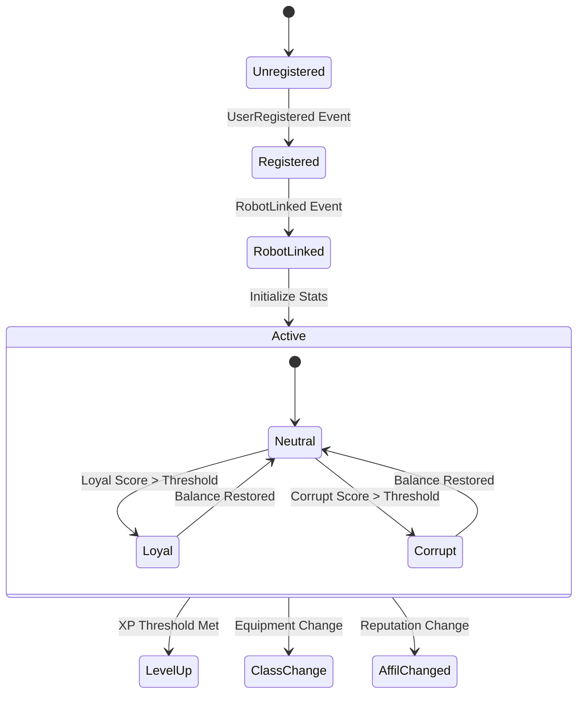
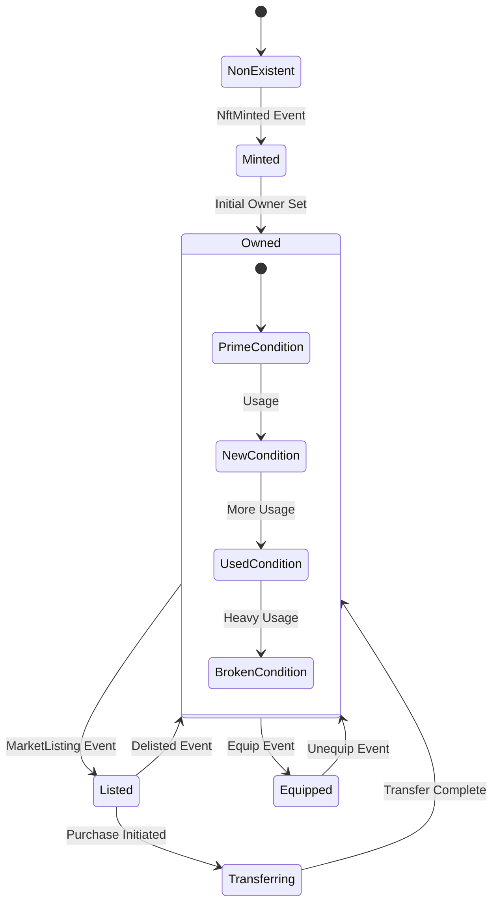

Task 2.1: L3 Smart Contracts - State Machine & Event Logic Implementation
(Functional & Secure for Core MVE Logic - All Classes, Affiliations, Items, Stats, Tokens with P2-level Default Initialization - Principles I, N, R)
Technical Reference
Rust (w/ Arbitrum Stylus) Smart Contract Language Documentation
OpenZeppelin Contracts Library (for security patterns like ReentrancyGuard, SafeMath)
Finalized v0.1 Protobuf Schemas (as the data model reference)
GDDs for P2-scope canonical rules
Context/Problem Statement
The L3 smart contract stubs deployed in Phase 1 are empty placeholders. To create a functional on-chain world, we must now implement the core business logic that governs all player state and assets. This task involves building out the "state machine" within our core contracts (BunkerguardManager, NftContract, etc.). This logic will process the events generated by transactions to deterministically mutate the on-chain state, effectively creating a verifiable and auditable history for every player.
Measurable Objectives
The BunkerguardManager smart contract is implemented with the full state machine logic for all P2-scope events.
The contract can correctly process UserRegistered, NftMinted, RobotLinked, and other P2 events to create and update a player's canonical on-chain state.
The implementation is pure, deterministic, and uses secure coding practices (e.g., protection against integer overflows).
All new smart contract code is exhaustively unit-tested and passes a mandatory security code review.
Implementation Guidance
Action: In /contracts/src/, fully implement the event application logic within the core L3 Smart Contracts. This logic will process committed events to deterministically mutate the on-chain state. For Phase 2, this includes processing events to update player token balances, manage NFT ownership, handle robot linkage, and initialize/update the robot's stats, class, and affiliation based on default values or simple P2 triggers.

## State Machine Diagrams

### Player State Transitions


### NFT State Machine


## Event Processing Implementation

### Core State Machine Implementation
```rust
use stylus_sdk::prelude::*;
use alloy_primitives::{Address, U256};
use alloy_sol_types::sol;

sol! {
    event UserRegistered(address indexed player, bytes32 playerId);
    event RobotLinked(address indexed player, bytes32 robotId);
    event StatsUpdated(address indexed player, uint256[12] stats);
    event ClassAssigned(address indexed player, uint8 class);
    event AffiliationChanged(address indexed player, uint8 affiliation);
}

#[solidity_storage]
pub struct BunkerguardManager {
    mapping(address => AgentChainState) player_states;
    mapping(bytes32 => bool) processed_events; // Idempotency
}

#[derive(SolidityType)]
pub struct AgentChainState {
    player_id: Address,
    balances: Balances,
    active_bunkerguard: ActiveBunkerguard,
    owned_nfts: Vec<bytes32>,
    reputation_loyal: i64,
    reputation_corrupt: i64,
    state_version: u32,
}

impl BunkerguardManager {
    /// Process UserRegistered with validation
    fn apply_user_registered(&mut self, player: Address, player_id: bytes32) -> Result<(), Error> {
        // Guard: Prevent duplicate registration
        if self.player_states.get(&player).player_id != Address::ZERO {
            return Err(Error::AlreadyRegistered);
        }
        
        // Guard: Check event idempotency
        let event_id = keccak256(abi.encode(player, player_id, block.number));
        if self.processed_events.get(&event_id) {
            return Ok(()); // Already processed, skip
        }
        
        // Initialize new player state
        let mut new_state = AgentChainState::default();
        new_state.player_id = player;
        new_state.balances = Balances {
            xp: U256::ZERO,
            ntc: U256::ZERO,
            credits: U256::ZERO,
        };
        
        // Set default Bunkerguard stats (all 10)
        new_state.active_bunkerguard = ActiveBunkerguard {
            robot_id: None,
            level: 1,
            stats: [10u16; 12], // All stats start at 10
            current_class: None,
            current_affiliation: Affiliation::Neutral,
            equipped_items: HashMap::new(),
        };
        
        // Persist state
        self.player_states.insert(player, new_state);
        self.processed_events.insert(event_id, true);
        
        // Emit confirmation event
        evm::log(UserRegistered { player, player_id });
        Ok(())
    }
    
    /// Process RobotLinked with state validation
    fn apply_robot_linked(&mut self, player: Address, robot_id: bytes32) -> Result<(), Error> {
        // Fetch existing state with validation
        let mut state = self.player_states.get_mut(&player)
            .ok_or(Error::PlayerNotFound)?;
        
        // Guard: Check robot ownership
        if !state.owned_nfts.contains(&robot_id) {
            return Err(Error::NotOwner);
        }
        
        // Guard: Check robot type
        let robot_details = self.nft_details.get(&robot_id)
            .ok_or(Error::NftNotFound)?;
        if robot_details.item_type != ItemType::BunkerguardRobot {
            return Err(Error::InvalidItemType);
        }
        
        // Update state
        let prev_robot = state.active_bunkerguard.robot_id;
        state.active_bunkerguard.robot_id = Some(robot_id);
        
        // If switching robots, reset temporary boosts
        if prev_robot.is_some() && prev_robot != Some(robot_id) {
            self.recalculate_stats(&mut state)?;
        }
        
        // Emit event
        evm::log(RobotLinked { player, robot_id });
        Ok(())
    }
    
    /// Process stat updates with validation
    fn apply_stats_updated(&mut self, player: Address, new_stats: [u16; 12]) -> Result<(), Error> {
        let mut state = self.player_states.get_mut(&player)
            .ok_or(Error::PlayerNotFound)?;
        
        // Validate stat ranges
        for stat in new_stats.iter() {
            if *stat < MIN_STAT || *stat > self.get_max_stat(state.active_bunkerguard.level) {
                return Err(Error::InvalidStatValue);
            }
        }
        
        // Check if stats actually changed
        if state.active_bunkerguard.stats == new_stats {
            return Ok(()); // No change, skip update
        }
        
        // Update stats
        let old_stats = state.active_bunkerguard.stats;
        state.active_bunkerguard.stats = new_stats;
        
        // Check for class change trigger
        let old_dominant = self.get_dominant_category(&old_stats);
        let new_dominant = self.get_dominant_category(&new_stats);
        
        if old_dominant != new_dominant {
            self.trigger_class_recalculation(&mut state)?;
        }
        
        // Emit event
        evm::log(StatsUpdated { player, stats: new_stats });
        Ok(())
    }
}
```

### Validation Rules and Guard Conditions

```rust
/// Comprehensive validation for state transitions
impl ValidationRules {
    const MIN_STAT: u16 = 1;
    const BASE_MAX_STAT: u16 = 100;
    const STAT_PER_LEVEL: u16 = 5;
    
    fn validate_registration(player: Address) -> Result<(), Error> {
        // Check blocklist
        if BLOCKED_ADDRESSES.contains(&player) {
            return Err(Error::Blocked);
        }
        
        // Check registration cooldown (prevent spam)
        if block.timestamp < last_registration_time + REGISTRATION_COOLDOWN {
            return Err(Error::CooldownActive);
        }
        
        Ok(())
    }
    
    fn validate_level_up(current_xp: U256, current_level: u32) -> Result<u32, Error> {
        let required_xp = calculate_xp_for_level(current_level + 1);
        
        if current_xp < required_xp {
            return Err(Error::InsufficientXP);
        }
        
        if current_level >= MAX_LEVEL {
            return Err(Error::MaxLevelReached);
        }
        
        Ok(current_level + 1)
    }
    
    fn validate_equipment_change(
        player_state: &AgentChainState,
        item_id: bytes32,
        slot: EquipmentSlot
    ) -> Result<(), Error> {
        // Check ownership
        if !player_state.owned_nfts.contains(&item_id) {
            return Err(Error::NotOwner);
        }
        
        // Check item type matches slot
        let item = get_nft_details(item_id)?;
        if !slot.accepts_type(item.item_type) {
            return Err(Error::SlotMismatch);
        }
        
        // Check level requirement
        if item.required_level > player_state.active_bunkerguard.level {
            return Err(Error::LevelTooLow);
        }
        
        // Check item condition
        if item.condition == ItemCondition::Broken {
            return Err(Error::ItemBroken);
        }
        
        Ok(())
    }
    
    fn validate_affiliation_change(
        loyal_score: i64,
        corrupt_score: i64,
        current: Affiliation
    ) -> Result<Affiliation, Error> {
        let difference = (loyal_score - corrupt_score).abs();
        let total = loyal_score.abs() + corrupt_score.abs();
        
        // Minimum activity requirement
        if total < MIN_AFFILIATION_ACTIVITY {
            return Ok(Affiliation::Neutral);
        }
        
        // Hysteresis to prevent rapid switching
        let threshold = match current {
            Affiliation::Neutral => AFFILIATION_THRESHOLD,
            _ => AFFILIATION_THRESHOLD + HYSTERESIS_BUFFER,
        };
        
        if difference < threshold {
            Ok(Affiliation::Neutral)
        } else if loyal_score > corrupt_score {
            Ok(Affiliation::Loyal)
        } else {
            Ok(Affiliation::Corrupt)
        }
    }
}
```

### Gas-Optimized Event Batching

```rust
/// Batch multiple events in a single transaction
pub struct EventBatch {
    events: Vec<EventPayload>,
    gas_used: U256,
    max_gas: U256,
}

impl BunkerguardManager {
    pub fn process_event_batch(&mut self, batch: EventBatch) -> Result<(), Error> {
        // Validate batch size
        if batch.events.len() > MAX_BATCH_SIZE {
            return Err(Error::BatchTooLarge);
        }
        
        // Process events with gas tracking
        let mut processed = 0;
        for event in batch.events {
            let gas_before = evm::gas_left();
            
            match event {
                EventPayload::UserRegistered(data) => {
                    self.apply_user_registered(data.player, data.player_id)?;
                }
                EventPayload::RobotLinked(data) => {
                    self.apply_robot_linked(data.player, data.robot_id)?;
                }
                // ... other event types
            }
            
            let gas_used = gas_before - evm::gas_left();
            if batch.gas_used + gas_used > batch.max_gas {
                break; // Stop processing to stay within gas limit
            }
            
            processed += 1;
        }
        
        // Return success with count of processed events
        evm::log(BatchProcessed { count: processed });
        Ok(())
    }
}
BunkerguardManager Contract State & apply Logic (Security Hardened & Lore-Rich):
This contract will contain the core state mapping, e.g., mapping(address => AgentChainState) public playerStates;. The AgentChainState struct will mirror the AgentChainStateProto schema.
The core logic will be implemented in internal functions that take an event payload and mutate the playerStates mapping. These functions are the core of the state machine; they must be pure (no external calls) and deterministic.
Implement logic for each event payload relevant to the P2 scope:
_applyUserRegistered: (Functionality from P1 verified and finalized). Initializes the player_id (msg.sender), sets initial balances (xp_balance: 0, ntc_balance: 0). Creates a default ActiveBunkerguardData with level: 1, final_stats (all 12 sub-stats at 10), current_class_opt: None, current_affiliation: Neutral, empty equipped_items.
_applyCreditsUpdated, _applyXpMinted, _applyXpBurned: Update the balances.xp_balance and balances.credits_balance. Must use a safe math library (like OpenZeppelin's SafeMath) to prevent integer overflow/underflow.
_applyNftMinted: Adds the nftId to the appropriate list within the player's owned_nft_ids_by_type mapping.
_applyNftTransferred (Simplified P2): This logic is applied to both sender and receiver states. It removes the nft_id from the sender's ownership list and adds it to the receiver's.
_applyNftMarketStatusUpdated: Adds or removes an nft_id from the player's market_listings_owned_ids.
_applyRobotLinked: Sets active_bunkerguard_data.robot_id to the event.robot_nft_id. If active_bunkerguard_data was uninitialized, it sets it to the same default state as UserRegistered.
_applyRobotUnlinked: Clears active_bunkerguard_data.robot_id and resets class, affiliation, and stats to a default "unlinked" state.
_applyRobotLevelledUp (Basic P2): Increments active_bunkerguard_data.level.
_applyReputationUpdated (Basic P2): Updates active_bunkerguard_data.reputation_score and points based on the event payload.
_applyRobotStatsUpdated: Replaces the entire active_bunkerguard_data.final_stats with the new values from the event payload.
_applyClassAssigned: Updates active_bunkerguard_data.current_class_opt.
_applyAffiliationAssigned: Updates active_bunkerguard_data.current_affiliation.
_applySocialConnectionAdded: Updates summary logs or lists within the on-chain state.
Security - Defense-in-Depth Validation: Although primary validation occurs in the public-facing transaction functions, these internal apply methods must still use checked_ arithmetic (or safe math libraries) as a final safeguard against state corruption from an invalid (but somehow committed) event.
Design Rationale
Implementing the core logic as a pure, event-sourcing state machine is a robust and auditable pattern for smart contracts. It clearly separates the "what happened" (the event) from the "how it happened" (the transaction execution logic). This makes the system's state transitions easier to reason about, test, and formally verify, which is critical for a high-value on-chain system.
Operational Considerations
The logic implemented in this task will be deployed as part of an upgradeable smart contract system (using a proxy pattern). The state (playerStates mapping) will be stored in the proxy's storage, allowing the logic contracts to be upgraded in the future without losing any player data.
Verification & Validation Criteria
Exhaustive unit tests for the state machine logic for every event type in the P2 scope are written and pass with high coverage.
Tests verify correct state mutations for balances, NFT ownership lists, robot linked state, and default stat/class/affiliation initialization.
The contracts are successfully deployed to the L3 testnet, replacing the P1 stubs.
Testing Methodologies
Unit Tests: Using a smart contract testing framework like Foundry or another Rust-compatible framework, write exhaustive tests for the internal apply logic for each event type.
o Example Test Case: test_apply_RobotLinked_initializes_defaults. Start with a fresh state, apply a RobotLinked event, and assert that the active_bunkerguard_data now exactly matches the GDD-defined default state.
o Test sequences of events (e.g., UserRegistered -> NftMinted -> RobotLinked) and verify the final state is correct.
Version Control Strategy
Branching: All smart contract development will occur on a feature/ branch (e.g., feature/p2-l3-state-machine).
Commits: The Git Commit message for this task will be exactly as specified.
Security Audit & Compliance Checkpoints
A mandatory, detailed peer review of all new smart contract code is required. The review must have a specific focus on:
o Ensuring deterministic logic.
o Preventing integer overflows/underflows by verifying SafeMath or equivalent is used for all arithmetic.
o Preventing any logic flaws that could lead to inconsistent or exploitable states.
ReviewedBy: L3 Smart Contracts Lead, Rust Backend Lead, Security Lead, Game Design Lead (for default state/rules accuracy).
ReviewOutcome: Approved for P2 scope.
ValidationMethod: All unit tests for P2 event sourcing and state derivation pass. State consistency is demonstrated for P2 event sequences using the full schema default values.
Git Commit here: @https://github.com/emiliancristea/bunkerverse-platform.git "Phase 2.1: Implemented L3 Smart Contracts Secure Event Sourcing & State Machine (P2 Logic with Full Schema Defaults for Class/Affiliation/Item/Stat/Token)." @Phase2/