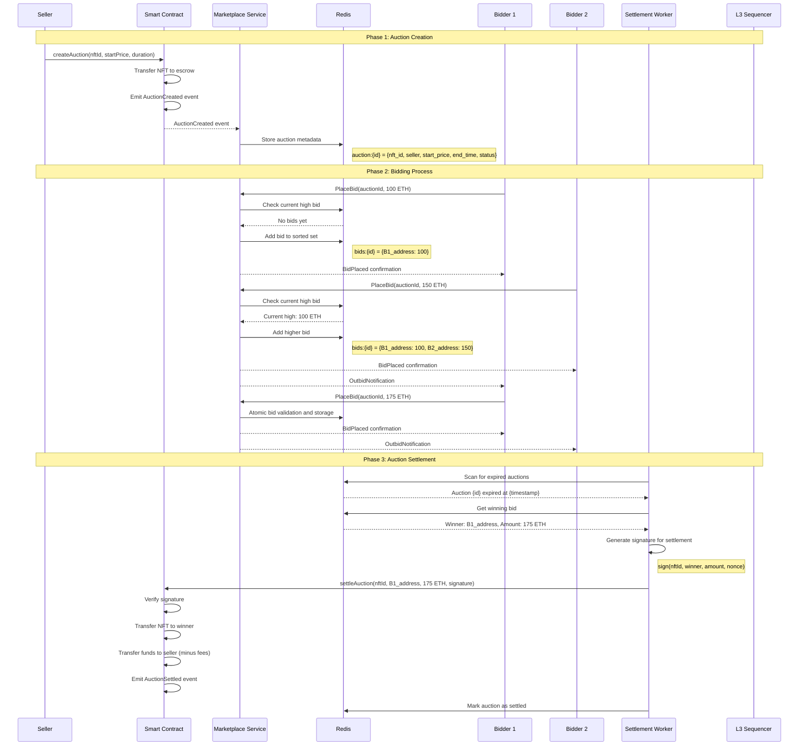
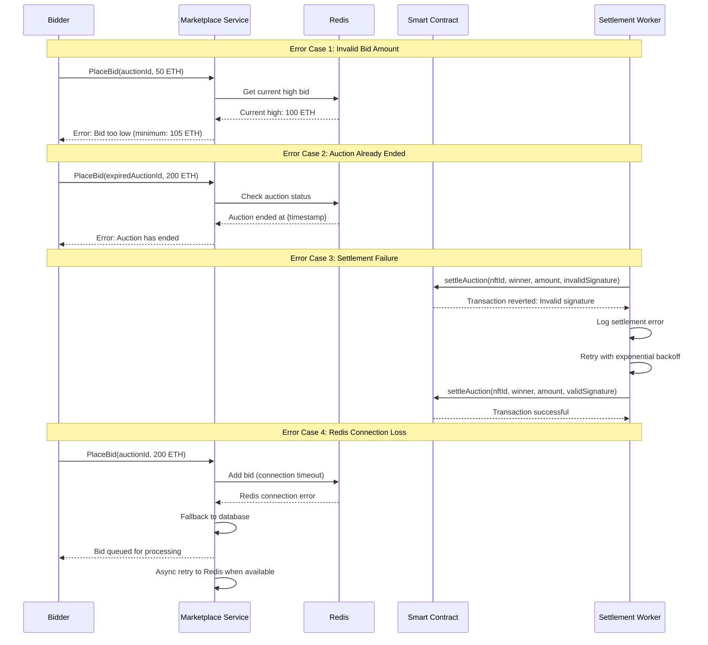
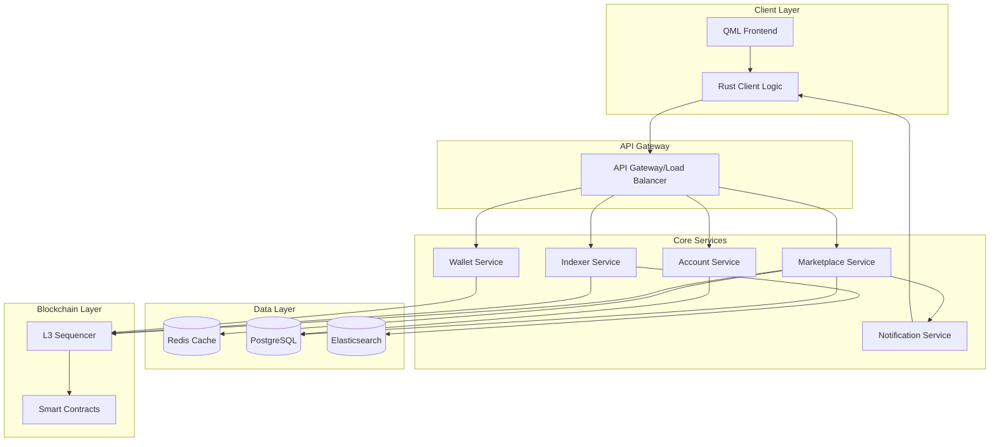

Task 3.2 (Revised & Expanded): THE PLAZA (Economic Hub) Implementation
(Functional Unified Marketplace, Auctions, and Rich Filtering with L3 Integration - Principles H, J, K, O, P, R)
1. Technical Reference
API Contracts (v0.1): marketplace_service.proto, indexer_service.proto, account_service.proto.
L3 Smart Contracts: Marketplace.rs, NftContract.rs, NTC.rs, Credits.rs ABIs.
UI/UX Design Document: docs/ui/CLIENT_QML_UI_DEFINITION_MVE_V0.1.md (specifically the sections for THE PLAZA and all its subpages).
Libraries: gRPC/tonic, sqlx, redis-rs, ethers-rs, serde, CXX-Qt, QML.

Library/Tool Versions:
| Library/Tool | Version | Notes |
|--------------|---------|-------|
| Qt SDK | 6.9.2 (MSVC 2022 64-bit) | Path: D:\DOCUMENTS\Qt\6.9.2\msvc2022_64 |
| cxx-qt Crate | 0.7.2 | The crate aims to support all Qt 6 versions; pinned for stability. |
| rustc | 1.80.0 (Stable) | Pinned via rust-toolchain.toml. |
2. Context/Problem Statement
Context: With the core navigation shell in place (Task 3.1), we must now build the economic heart of the BUNKERVERSE. The Plaza is the central hub for all commercial activity, and its functionality is the primary driver for the in-verse economy.
Problem: The MVE requires a sophisticated, multi-faceted commercial district, not just a simple "for sale" page. This includes a unified marketplace for both primary and secondary sales, a dedicated auction house, and curated views for specific item types. Building this requires a significant enhancement of the backend services to handle complex state like auctions, a more powerful Indexer to support rich filtering, and a complex, multi-page client UI that presents these features to the user in an intuitive and secure manner.
3. Measurable Objectives
1. Backend:
The Rust Marketplace Service is enhanced to manage the full off-chain lifecycle of timed auctions.
The Marketplace L3 smart contract is enhanced with a secure, signature-based settleAuction function.
The Indexer Service is enhanced with a new, dedicated index for active auctions and supports advanced, multi-faceted filtering on all listings.
2. Client (QML & Rust):
o The full PLAZA UI and all its functional subpages (MarketplacePage, AuctionsPage, CollectiblesPage, CosmeticsPage) are implemented, replacing all placeholders.
o The EXCHANGE, TradingPage, and UpgradesPage are implemented as polished, locked/disabled placeholders.
3. End-to-End Validation:
The full P2P "buy now" lifecycle is functional.
The full P2P auction lifecycle is functional: a user can list an item for auction, another user can place a bid, the auction is correctly settled on-chain after its timer expires, and the assets are correctly transferred.
4. Implementation Guidance
1. Marketplace.rs:
o Auction State: Add a new mapping: mapping(uint256 => Auction) public auctions; to store on-chain details of settled auctions for historical purposes.
o settle_auction function:
Signature: pub fn settle_auction(&mut self, nft_id: U256, winner: Address, amount: U256, signature: Vec<u8>)
Access Control: This function must be public but will be logically protected by signature verification.
Signature Validation (Critical Security):
Retrieve the trusted marketplace_service_signer_address from contract storage (set by admin).
Construct the message digest keccak256(abi.encodePacked(nftId, winner, amount)).
Use ecrecover to extract the address that signed the message.
Require that the recovered address matches the marketplace_service_signer_address. If not, the transaction must revert with a PermissionDenied error.
Logic: If the signature is valid, it will call the existing internal _execute_trade function, passing the auction winner and amount. This reuses the same secure logic for NFT/Credit transfers and fee distribution.
Emit an AuctionSettled event.

## Ed25519 Signature Verification Implementation

### Smart Contract Signature Verification
```rust
// marketplace_contract.rs
use stylus_sdk::{
    prelude::*,
    crypto::{keccak256, ecrecover},
    storage::{StorageAddress, StorageU256, StorageMap},
    msg,
};

#[storage]
#[entrypoint]
pub struct MarketplaceContract {
    marketplace_signer: StorageAddress,
    settled_auctions: StorageMap<U256, AuctionResult>,
    nonce_tracker: StorageMap<Address, StorageU256>,
}

#[derive(Debug, Clone)]
struct AuctionResult {
    nft_id: U256,
    winner: Address,
    final_amount: U256,
    settled_at: U256,
}

#[external]
impl MarketplaceContract {
    pub fn settle_auction_with_ed25519(
        &mut self,
        nft_id: U256,
        winner: Address,
        amount: U256,
        nonce: U256,
        signature: [u8; 64], // Ed25519 signature is 64 bytes
        public_key: [u8; 32], // Ed25519 public key is 32 bytes
    ) -> Result<(), MarketplaceError> {
        // Verify the public key belongs to authorized signer
        let authorized_key_hash = self.marketplace_signer.get();
        let provided_key_hash = keccak256(&public_key);
        
        if authorized_key_hash != Address::from(provided_key_hash) {
            return Err(MarketplaceError::UnauthorizedSigner);
        }
        
        // Prevent replay attacks with nonce
        let current_nonce = self.nonce_tracker.get(authorized_key_hash);
        if nonce <= current_nonce {
            return Err(MarketplaceError::InvalidNonce);
        }
        
        // Construct message for verification
        let message = self.construct_settlement_message(nft_id, winner, amount, nonce);
        
        // Verify Ed25519 signature
        if !self.verify_ed25519_signature(&message, &signature, &public_key) {
            return Err(MarketplaceError::InvalidSignature);
        }
        
        // Update nonce to prevent replay
        self.nonce_tracker.setter(authorized_key_hash).set(nonce);
        
        // Execute the settlement
        self.execute_auction_settlement(nft_id, winner, amount)?;
        
        Ok(())
    }
    
    pub fn settle_auction_with_ecdsa(
        &mut self,
        nft_id: U256,
        winner: Address,
        amount: U256,
        nonce: U256,
        v: u8,
        r: [u8; 32],
        s: [u8; 32],
    ) -> Result<(), MarketplaceError> {
        // Construct the message hash
        let message = self.construct_settlement_message(nft_id, winner, amount, nonce);
        let message_hash = keccak256(&message);
        
        // Recover signer address from signature
        let recovered_address = ecrecover(message_hash, v, r, s)
            .ok_or(MarketplaceError::InvalidSignature)?;
            
        // Verify against authorized signer
        if recovered_address != self.marketplace_signer.get() {
            return Err(MarketplaceError::UnauthorizedSigner);
        }
        
        // Check nonce for replay protection
        let current_nonce = self.nonce_tracker.get(recovered_address);
        if nonce <= current_nonce {
            return Err(MarketplaceError::InvalidNonce);
        }
        
        // Update nonce
        self.nonce_tracker.setter(recovered_address).set(nonce);
        
        // Execute settlement
        self.execute_auction_settlement(nft_id, winner, amount)?;
        
        Ok(())
    }
    
    fn construct_settlement_message(
        &self,
        nft_id: U256,
        winner: Address,
        amount: U256,
        nonce: U256,
    ) -> Vec<u8> {
        // Create deterministic message for signing
        let mut message = Vec::new();
        message.extend_from_slice(&nft_id.to_be_bytes());
        message.extend_from_slice(&winner.0);
        message.extend_from_slice(&amount.to_be_bytes());
        message.extend_from_slice(&nonce.to_be_bytes());
        message.extend_from_slice(b"BUNKERVERSE_AUCTION_SETTLEMENT");
        message
    }
    
    fn verify_ed25519_signature(
        &self,
        message: &[u8],
        signature: &[u8; 64],
        public_key: &[u8; 32],
    ) -> bool {
        // In a real implementation, use a proper Ed25519 verification library
        // This is a placeholder for the actual cryptographic verification
        
        // For Stylus, you might need to use a precompiled contract or
        // integrate with a WASM-compatible Ed25519 library
        
        // Pseudo-implementation:
        use ed25519_dalek::{PublicKey, Signature, Verifier};
        
        let public_key = match PublicKey::from_bytes(public_key) {
            Ok(key) => key,
            Err(_) => return false,
        };
        
        let signature = match Signature::from_bytes(signature) {
            Ok(sig) => sig,
            Err(_) => return false,
        };
        
        public_key.verify(message, &signature).is_ok()
    }
    
    fn execute_auction_settlement(
        &mut self,
        nft_id: U256,
        winner: Address,
        amount: U256,
    ) -> Result<(), MarketplaceError> {
        // Verify auction exists and hasn't been settled
        if self.settled_auctions.get(nft_id).is_some() {
            return Err(MarketplaceError::AuctionAlreadySettled);
        }
        
        // Execute the trade (transfer NFT, handle payments, fees)
        self.execute_trade_internal(nft_id, winner, amount)?;
        
        // Record settlement
        let auction_result = AuctionResult {
            nft_id,
            winner,
            final_amount: amount,
            settled_at: U256::from(block::timestamp()),
        };
        
        self.settled_auctions.setter(nft_id).set(auction_result);
        
        // Emit settlement event
        evm::log(AuctionSettled {
            nft_id,
            winner,
            final_amount: amount,
            seller: self.get_nft_seller(nft_id)?,
        });
        
        Ok(())
    }
}

#[derive(Debug, thiserror::Error)]
pub enum MarketplaceError {
    #[error("Unauthorized signer")]
    UnauthorizedSigner,
    #[error("Invalid signature")]
    InvalidSignature,
    #[error("Invalid nonce - replay attack prevented")]
    InvalidNonce,
    #[error("Auction already settled")]
    AuctionAlreadySettled,
    #[error("NFT not found or not in auction")]
    NftNotFound,
    #[error("Trade execution failed: {0}")]
    TradeExecutionFailed(String),
}

#[derive(Debug)]
struct AuctionSettled {
    nft_id: U256,
    winner: Address,
    final_amount: U256,
    seller: Address,
}
```

### Off-chain Ed25519 Signing Service
```rust
// signature_service.rs
use ed25519_dalek::{Keypair, PublicKey, SecretKey, Signature, Signer};
use serde::{Deserialize, Serialize};
use std::sync::Arc;
use tokio::sync::RwLock;

#[derive(Debug, Clone, Serialize, Deserialize)]
pub struct SettlementRequest {
    pub nft_id: String,
    pub winner_address: String,
    pub final_amount: String,
    pub auction_end_time: i64,
}

#[derive(Debug, Clone, Serialize, Deserialize)]
pub struct SettlementSignature {
    pub nft_id: String,
    pub winner_address: String,
    pub final_amount: String,
    pub nonce: u64,
    pub signature: Vec<u8>,
    pub public_key: Vec<u8>,
    pub message_hash: Vec<u8>,
}

pub struct Ed25519SigningService {
    keypair: Arc<RwLock<Keypair>>,
    nonce_counter: Arc<RwLock<u64>>,
}

impl Ed25519SigningService {
    pub fn new(private_key_bytes: &[u8]) -> Result<Self, SignatureError> {
        let secret_key = SecretKey::from_bytes(private_key_bytes)
            .map_err(|_| SignatureError::InvalidPrivateKey)?;
            
        let public_key = PublicKey::from(&secret_key);
        let keypair = Keypair { secret: secret_key, public: public_key };
        
        Ok(Self {
            keypair: Arc::new(RwLock::new(keypair)),
            nonce_counter: Arc::new(RwLock::new(1)),
        })
    }
    
    pub async fn sign_auction_settlement(
        &self,
        request: SettlementRequest,
    ) -> Result<SettlementSignature, SignatureError> {
        let keypair = self.keypair.read().await;
        let mut nonce_counter = self.nonce_counter.write().await;
        
        let nonce = *nonce_counter;
        *nonce_counter += 1;
        
        // Construct message (must match smart contract's message construction)
        let message = self.construct_message(&request, nonce)?;
        
        // Sign the message
        let signature = keypair.sign(&message);
        
        Ok(SettlementSignature {
            nft_id: request.nft_id,
            winner_address: request.winner_address,
            final_amount: request.final_amount,
            nonce,
            signature: signature.to_bytes().to_vec(),
            public_key: keypair.public.to_bytes().to_vec(),
            message_hash: sha3::Keccak256::digest(&message).to_vec(),
        })
    }
    
    fn construct_message(&self, request: &SettlementRequest, nonce: u64) -> Result<Vec<u8>, SignatureError> {
        let mut message = Vec::new();
        
        // Parse and validate inputs
        let nft_id = request.nft_id.parse::<u128>()
            .map_err(|_| SignatureError::InvalidNftId)?;
            
        let winner_address = hex::decode(
            request.winner_address.strip_prefix("0x").unwrap_or(&request.winner_address)
        ).map_err(|_| SignatureError::InvalidAddress)?;
        
        let amount = request.final_amount.parse::<u128>()
            .map_err(|_| SignatureError::InvalidAmount)?;
        
        // Construct message (must match smart contract exactly)
        message.extend_from_slice(&nft_id.to_be_bytes());
        message.extend_from_slice(&winner_address);
        message.extend_from_slice(&amount.to_be_bytes());
        message.extend_from_slice(&nonce.to_be_bytes());
        message.extend_from_slice(b"BUNKERVERSE_AUCTION_SETTLEMENT");
        
        Ok(message)
    }
    
    pub async fn get_public_key(&self) -> Vec<u8> {
        let keypair = self.keypair.read().await;
        keypair.public.to_bytes().to_vec()
    }
    
    pub fn verify_signature(
        message: &[u8],
        signature_bytes: &[u8],
        public_key_bytes: &[u8],
    ) -> bool {
        let public_key = match PublicKey::from_bytes(public_key_bytes) {
            Ok(key) => key,
            Err(_) => return false,
        };
        
        let signature = match Signature::from_bytes(signature_bytes) {
            Ok(sig) => sig,
            Err(_) => return false,
        };
        
        use ed25519_dalek::Verifier;
        public_key.verify(message, &signature).is_ok()
    }
}

#[derive(Debug, thiserror::Error)]
pub enum SignatureError {
    #[error("Invalid private key format")]
    InvalidPrivateKey,
    #[error("Invalid NFT ID")]
    InvalidNftId,
    #[error("Invalid address format")]
    InvalidAddress,
    #[error("Invalid amount format")]
    InvalidAmount,
    #[error("Signature generation failed")]
    SignatureFailed,
}
```
Marketplace Service (/services/marketplace/):
API Definition (marketplace_service.proto): Add new RPCs: GetAuctions, PlaceBid(auctionId, amount), and an internal-only TriggerAuctionSettlement(auctionId).
Off-Chain Auction Logic (Redis):
When an item is listed for auction, store its details and end-time in Redis.
Use a Redis sorted set for bids (bids:{auctionId}) with the score as the bid amount.
PlaceBid RPC: Authenticates the user's JWT. Validates the bid amount. Atomically checks if the bid is higher than the current top score in the sorted set and adds it.
Auction Settlement Worker:
Implement a background worker (a separate Tokio task).
This worker will periodically scan Redis for auctions whose end-time has passed.
When an expired auction is found, it will retrieve the winning bid, sign the results (nftId, winner, amount) with its securely loaded private key, and call the settleAuction transaction on the L3 smart contract.

## Auction Lifecycle Sequence Diagrams

### Complete Auction Lifecycle


### Error Handling in Auctions


## Redis Locking Patterns for Race Condition Prevention

### Atomic Bid Processing with Redis Locks
```rust
// auction_service.rs
use redis::{AsyncCommands, RedisResult};
use uuid::Uuid;
use std::time::Duration;
use tokio::time::{sleep, timeout};

pub struct AuctionService {
    redis_client: redis::Client,
    lock_timeout: Duration,
    lock_retry_delay: Duration,
    max_lock_attempts: u32,
}

impl AuctionService {
    pub async fn place_bid_atomically(
        &self,
        auction_id: &str,
        bidder_address: &str,
        bid_amount: u64,
    ) -> Result<BidResult, AuctionError> {
        let lock_key = format!("auction_lock:{}", auction_id);
        let lock_value = Uuid::new_v4().to_string();
        
        // Acquire distributed lock
        let lock_acquired = self.acquire_lock(&lock_key, &lock_value).await?;
        
        if !lock_acquired {
            return Err(AuctionError::ConcurrentBidding);
        }
        
        // Ensure lock is released even if panic occurs
        let _guard = LockGuard::new(self.redis_client.clone(), lock_key.clone(), lock_value.clone());
        
        let result = self.process_bid_under_lock(auction_id, bidder_address, bid_amount).await;
        
        // Lock will be automatically released by the guard
        result
    }
    
    async fn acquire_lock(&self, lock_key: &str, lock_value: &str) -> Result<bool, AuctionError> {
        let mut conn = self.redis_client.get_async_connection().await?;
        let mut attempt = 0;
        
        while attempt < self.max_lock_attempts {
            // Use SET NX EX for atomic lock acquisition
            let result: Option<String> = conn.set_options(
                lock_key,
                lock_value,
                redis::SetOptions::default()
                    .conditional_set(redis::ExistenceCheck::NX)
                    .get(true)
                    .with_expiration(redis::SetExpiry::EX(self.lock_timeout.as_secs() as usize))
            ).await?;
            
            if result.is_none() {
                // Lock acquired successfully
                return Ok(true);
            }
            
            attempt += 1;
            if attempt < self.max_lock_attempts {
                sleep(self.lock_retry_delay).await;
            }
        }
        
        Ok(false)
    }
    
    async fn process_bid_under_lock(
        &self,
        auction_id: &str,
        bidder_address: &str,
        bid_amount: u64,
    ) -> Result<BidResult, AuctionError> {
        let mut conn = self.redis_client.get_async_connection().await?;
        
        // Check auction status
        let auction_key = format!("auction:{}", auction_id);
        let auction_data: Option<String> = conn.get(&auction_key).await?;
        
        let auction = auction_data
            .ok_or(AuctionError::AuctionNotFound)?
            .parse::<AuctionData>()
            .map_err(|_| AuctionError::InvalidAuctionData)?;
            
        // Validate auction is still active
        if auction.end_time <= chrono::Utc::now().timestamp() {
            return Err(AuctionError::AuctionEnded);
        }
        
        // Get current highest bid using ZREVRANGE
        let bids_key = format!("bids:{}", auction_id);
        let highest_bid: Vec<(String, f64)> = conn
            .zrevrange_withscores(&bids_key, 0, 0)
            .await?;
            
        let current_high_bid = highest_bid
            .first()
            .map(|(_, score)| *score as u64)
            .unwrap_or(auction.start_price);
            
        // Validate bid amount
        let min_bid = current_high_bid + auction.min_increment;
        if bid_amount < min_bid {
            return Err(AuctionError::BidTooLow { 
                current_high: current_high_bid,
                minimum: min_bid 
            });
        }
        
        // Check bidder's balance (if integrated with wallet service)
        self.validate_bidder_balance(bidder_address, bid_amount).await?;
        
        // Add bid atomically using pipeline
        let mut pipe = redis::pipe();
        pipe.zadd(&bids_key, bidder_address, bid_amount as f64);
        pipe.hset(&format!("bid_details:{}", auction_id), bidder_address, 
                 serde_json::to_string(&BidDetails {
                     amount: bid_amount,
                     timestamp: chrono::Utc::now().timestamp(),
                     tx_hash: None, // Will be filled when funds are locked
                 })?); 
        pipe.execute_async(&mut conn).await?;
        
        // Notify previous high bidder if they were outbid
        if let Some((previous_bidder, _)) = highest_bid.first() {
            if previous_bidder != bidder_address {
                self.notify_outbid(previous_bidder, auction_id, bid_amount).await?;
            }
        }
        
        Ok(BidResult {
            success: true,
            new_high_bid: bid_amount,
            previous_high_bid: current_high_bid,
        })
    }
    
    async fn validate_bidder_balance(&self, bidder_address: &str, amount: u64) -> Result<(), AuctionError> {
        // In a real implementation, call wallet service to check balance
        // For now, just validate address format
        if !self.is_valid_address(bidder_address) {
            return Err(AuctionError::InvalidAddress);
        }
        Ok(())
    }
    
    async fn notify_outbid(&self, bidder_address: &str, auction_id: &str, new_amount: u64) -> Result<(), AuctionError> {
        // Implement notification logic (WebSocket, push notification, etc.)
        info!("Notifying {} that they were outbid on auction {} (new bid: {})", 
              bidder_address, auction_id, new_amount);
        Ok(())
    }
}

// RAII lock guard for automatic cleanup
struct LockGuard {
    client: redis::Client,
    lock_key: String,
    lock_value: String,
}

impl LockGuard {
    fn new(client: redis::Client, lock_key: String, lock_value: String) -> Self {
        Self { client, lock_key, lock_value }
    }
}

impl Drop for LockGuard {
    fn drop(&mut self) {
        // Release lock asynchronously in background
        let client = self.client.clone();
        let lock_key = self.lock_key.clone();
        let lock_value = self.lock_value.clone();
        
        tokio::spawn(async move {
            if let Ok(mut conn) = client.get_async_connection().await {
                // Use Lua script to ensure we only delete our own lock
                let script = r#"
                    if redis.call('get', KEYS[1]) == ARGV[1] then
                        return redis.call('del', KEYS[1])
                    else
                        return 0
                    end
                "#;
                
                let _: Result<i32, _> = redis::Script::new(script)
                    .key(&lock_key)
                    .arg(&lock_value)
                    .invoke_async(&mut conn)
                    .await;
            }
        });
    }
}

#[derive(Debug, Serialize, Deserialize)]
struct AuctionData {
    nft_id: String,
    seller: String,
    start_price: u64,
    min_increment: u64,
    end_time: i64,
    status: AuctionStatus,
}

#[derive(Debug, Serialize, Deserialize)]
struct BidDetails {
    amount: u64,
    timestamp: i64,
    tx_hash: Option<String>,
}

#[derive(Debug)]
struct BidResult {
    success: bool,
    new_high_bid: u64,
    previous_high_bid: u64,
}

#[derive(Debug, thiserror::Error)]
pub enum AuctionError {
    #[error("Redis connection error: {0}")]
    RedisError(#[from] redis::RedisError),
    #[error("Auction not found")]
    AuctionNotFound,
    #[error("Invalid auction data")]
    InvalidAuctionData,
    #[error("Auction has ended")]
    AuctionEnded,
    #[error("Bid too low: current high {current_high}, minimum {minimum}")]
    BidTooLow { current_high: u64, minimum: u64 },
    #[error("Invalid bidder address")]
    InvalidAddress,
    #[error("Concurrent bidding detected, please retry")]
    ConcurrentBidding,
    #[error("Insufficient balance")]
    InsufficientBalance,
}
```
Indexer Service (/indexer/):
o Event Ingestion: Enhance the L3 event subscriber to consume AuctionCreated and AuctionSettled events.
o New Index (market_auctions_active): Create a new index in Elasticsearch. When an AuctionCreated event is received, add a document. When an AuctionSettled event is received, remove the document from this index. This keeps the index small and fast.
o Enhanced Filtering: The GetMarketListings logic will now be a complex query builder that can combine multiple filters (Rarity, Class, Stats) from the gRPC request into a single, efficient Elasticsearch query.
Rust Application Logic (/client/rust-app-logic/src/plaza/):
Create new handler modules for each subpage (auctions_handler.rs, etc.).
Implement new #[cxx_qt::qinvokable] functions: fetchAuctions, placeBid, and enhance fetchMarketListings to accept a complex filter object.
QML Frontend (/client/qml-ui/screens/plaza/):
MarketplacePage.qml (The Main Hub):
Layout: A sophisticated GridView of items. Implement a powerful filtering side panel with controls for every indexed NFT attribute (sliders for stats, checkboxes for rarity/class, etc.). The main toggle for BUNKER CORP vs. P2P listings will be prominent.
Backend Interaction: The GridView will be bound to a rustBackend property. As filters are changed in the side panel, a filterObject is constructed in QML and passed to rustBackend.fetchMarketListings(filterObject).
AuctionsPage.qml (Auction House):
Layout: A ListView where each delegate shows an item, its current highest bid, the number of bids, and a countdown timer to the auction's end.
Backend Interaction: On load, calls rustBackend.fetchAuctions. The UI will poll this endpoint or use a WebSocket for live updates on new bids and timers.
Bidding Logic: Clicking "Place Bid" opens a Dialog where the user enters their bid amount. Confirming calls rustBackend.placeBid(auctionId, amount). The UI will provide real-time feedback on whether the bid was successful (e.g., "You are the new highest bidder!") or failed ("Your bid is too low.").
CollectiblesPage.qml & CosmeticsPage.qml:
These will be implemented as curated views. They will reuse the same core MarketplacePage.qml components but will be hardcoded to pass a specific ItemType filter to rustBackend.fetchMarketListings.
TradingPage.qml, UpgradesPage.qml, and Exchange sub-tab:
These will be implemented as polished, functional but disabled placeholder screens/tabs with clear "Coming Post-MVE" messaging.
5. Design Rationale
A multi-faceted Plaza with distinct UIs for different commercial activities (direct sales vs. auctions) creates a more organized and engaging user experience. The off-chain bidding for auctions, secured by on-chain signature settlement, is a critical design pattern that provides the fast, responsive bidding experience users expect, while maintaining the ultimate security and finality of a true on-chain transaction.
6. Operational Considerations
Local-First: All functionality, including the auction worker, will be tested against the local Docker Compose simulation.
Cloud-Ready: The private key for the Marketplace Service is a critical secret that will be stored in AWS Secrets Manager. The Redis instance for managing bids will be a managed ElastiCache instance. The auction settlement worker will run as a dedicated, non-public-facing deployment in Kubernetes.
7. Verification & Validation Criteria
A user can browse the unified Marketplace and apply complex, multi-faceted filters.
The full P2P auction lifecycle is functional: list, bid, auto-settlement on-chain after timer expiry, and correct asset transfer.
The specialized Collectibles and Cosmetics views correctly filter the marketplace data.
8. Testing Methodologies
Unit Tests: For the off-chain auction logic and bid validation in the Marketplace Service. For the signature verification logic in the L3 smart contract.
Integration Tests: A full integration test will run in the local Docker Compose environment. A test harness will: 1) list an item for auction via gRPC, 2) place several bids, 3) advance the system clock, 4) verify the auction worker triggers and successfully submits the settleAuction transaction to the L3.
E2E Tests: A scripted manual E2E test involving three client instances: one lister, and two bidders engaging in a bidding war.
9. Version Control Strategy
Branching: The enhanced Plaza is a major feature set and will be developed on a feature/plaza-full-implementation branch.
Commits: The Git Commit message for this task will be exactly as specified.
10. Security Audit & Compliance Checkpoints
A mandatory, exhaustive security audit of the settleAuction smart contract function is required, focusing on the signature verification logic to ensure no replay attacks are possible.
The off-chain Marketplace Service must be audited to prevent exploits in the bidding process (e.g., race conditions, bid submission vulnerabilities, denial-of-service against the settlement worker).

## Multi-Service Coordination Details

### Service Communication Architecture


### Event-Driven Service Coordination
```rust
// service_coordinator.rs
use async_trait::async_trait;
use serde::{Deserialize, Serialize};
use std::collections::HashMap;
use tokio::sync::{broadcast, RwLock};
use uuid::Uuid;

#[derive(Debug, Clone, Serialize, Deserialize)]
pub enum ServiceEvent {
    AuctionCreated {
        auction_id: String,
        nft_id: String,
        seller: String,
        start_price: u64,
        end_time: i64,
    },
    BidPlaced {
        auction_id: String,
        bidder: String,
        amount: u64,
        timestamp: i64,
    },
    AuctionSettled {
        auction_id: String,
        winner: String,
        final_amount: u64,
        transaction_hash: String,
    },
    UserBalanceChanged {
        user_address: String,
        old_balance: u64,
        new_balance: u64,
        change_reason: String,
    },
    NftTransferred {
        nft_id: String,
        from: String,
        to: String,
        transaction_hash: String,
    },
}

#[async_trait]
pub trait EventHandler: Send + Sync {
    async fn handle_event(&self, event: &ServiceEvent) -> Result<(), HandlerError>;
    fn interested_events(&self) -> Vec<String>;
}

pub struct ServiceCoordinator {
    event_bus: broadcast::Sender<ServiceEvent>,
    handlers: RwLock<HashMap<String, Vec<Box<dyn EventHandler>>>>,
}

impl ServiceCoordinator {
    pub fn new() -> Self {
        let (event_bus, _) = broadcast::channel(1000);
        
        Self {
            event_bus,
            handlers: RwLock::new(HashMap::new()),
        }
    }
    
    pub async fn register_handler(&self, handler: Box<dyn EventHandler>) {
        let mut handlers = self.handlers.write().await;
        
        for event_type in handler.interested_events() {
            handlers.entry(event_type)
                .or_insert_with(Vec::new)
                .push(handler.clone()); // Note: This requires Clone to be implemented
        }
    }
    
    pub async fn publish_event(&self, event: ServiceEvent) -> Result<(), CoordinationError> {
        // Log the event
        tracing::info!("Publishing event: {:?}", event);
        
        // Send to event bus
        self.event_bus.send(event.clone())
            .map_err(|_| CoordinationError::EventBusError)?;
            
        // Execute handlers directly for critical events
        let event_type = self.get_event_type(&event);
        let handlers = self.handlers.read().await;
        
        if let Some(event_handlers) = handlers.get(&event_type) {
            let mut handler_futures = Vec::new();
            
            for handler in event_handlers {
                let handler_future = handler.handle_event(&event);
                handler_futures.push(handler_future);
            }
            
            // Execute all handlers concurrently
            let results = futures::future::join_all(handler_futures).await;
            
            // Collect any errors
            let errors: Vec<_> = results.into_iter()
                .filter_map(|r| r.err())
                .collect();
                
            if !errors.is_empty() {
                tracing::error!("Handler errors: {:?}", errors);
                return Err(CoordinationError::HandlerErrors(errors));
            }
        }
        
        Ok(())
    }
    
    fn get_event_type(&self, event: &ServiceEvent) -> String {
        match event {
            ServiceEvent::AuctionCreated { .. } => "AuctionCreated".to_string(),
            ServiceEvent::BidPlaced { .. } => "BidPlaced".to_string(),
            ServiceEvent::AuctionSettled { .. } => "AuctionSettled".to_string(),
            ServiceEvent::UserBalanceChanged { .. } => "UserBalanceChanged".to_string(),
            ServiceEvent::NftTransferred { .. } => "NftTransferred".to_string(),
        }
    }
}

// Example handler implementations
pub struct IndexerEventHandler {
    indexer_client: Arc<dyn IndexerClient>,
}

#[async_trait]
impl EventHandler for IndexerEventHandler {
    async fn handle_event(&self, event: &ServiceEvent) -> Result<(), HandlerError> {
        match event {
            ServiceEvent::AuctionCreated { auction_id, nft_id, seller, start_price, end_time } => {
                self.indexer_client.index_auction(IndexAuctionRequest {
                    auction_id: auction_id.clone(),
                    nft_id: nft_id.clone(),
                    seller: seller.clone(),
                    start_price: *start_price,
                    end_time: *end_time,
                    status: "active".to_string(),
                }).await.map_err(HandlerError::IndexerError)?;
            },
            ServiceEvent::AuctionSettled { auction_id, winner, final_amount, transaction_hash } => {
                self.indexer_client.update_auction_status(UpdateAuctionRequest {
                    auction_id: auction_id.clone(),
                    status: "settled".to_string(),
                    winner: Some(winner.clone()),
                    final_amount: Some(*final_amount),
                    transaction_hash: Some(transaction_hash.clone()),
                }).await.map_err(HandlerError::IndexerError)?;
            },
            _ => {} // Ignore other events
        }
        Ok(())
    }
    
    fn interested_events(&self) -> Vec<String> {
        vec!["AuctionCreated".to_string(), "AuctionSettled".to_string()]
    }
}

pub struct NotificationEventHandler {
    notification_service: Arc<dyn NotificationService>,
}

#[async_trait]
impl EventHandler for NotificationEventHandler {
    async fn handle_event(&self, event: &ServiceEvent) -> Result<(), HandlerError> {
        match event {
            ServiceEvent::BidPlaced { auction_id, bidder, amount, .. } => {
                // Notify auction participants
                self.notification_service.notify_bid_placed(
                    auction_id,
                    bidder,
                    *amount,
                ).await.map_err(HandlerError::NotificationError)?;
            },
            ServiceEvent::AuctionSettled { auction_id, winner, final_amount, .. } => {
                // Notify winner and other participants
                self.notification_service.notify_auction_settled(
                    auction_id,
                    winner,
                    *final_amount,
                ).await.map_err(HandlerError::NotificationError)?;
            },
            _ => {}
        }
        Ok(())
    }
    
    fn interested_events(&self) -> Vec<String> {
        vec!["BidPlaced".to_string(), "AuctionSettled".to_string()]
    }
}

#[derive(Debug, thiserror::Error)]
pub enum CoordinationError {
    #[error("Event bus error")]
    EventBusError,
    #[error("Multiple handler errors: {0:?}")]
    HandlerErrors(Vec<HandlerError>),
}

#[derive(Debug, thiserror::Error)]
pub enum HandlerError {
    #[error("Indexer error: {0}")]
    IndexerError(String),
    #[error("Notification error: {0}")]
    NotificationError(String),
    #[error("Database error: {0}")]
    DatabaseError(String),
}
```

### Circuit Breaker Pattern for Service Resilience
```rust
// circuit_breaker.rs
use std::sync::{Arc, atomic::{AtomicU64, AtomicUsize, Ordering}};
use std::time::{Duration, Instant};
use tokio::time::sleep;

#[derive(Debug, Clone, Copy, PartialEq)]
pub enum CircuitState {
    Closed,     // Normal operation
    Open,       // Blocking requests
    HalfOpen,   // Testing if service recovered
}

pub struct CircuitBreaker {
    state: Arc<AtomicUsize>, // 0=Closed, 1=Open, 2=HalfOpen
    failure_count: Arc<AtomicU64>,
    last_failure_time: Arc<AtomicU64>,
    config: CircuitBreakerConfig,
}

#[derive(Debug, Clone)]
pub struct CircuitBreakerConfig {
    pub failure_threshold: u64,
    pub timeout: Duration,
    pub reset_timeout: Duration,
}

impl Default for CircuitBreakerConfig {
    fn default() -> Self {
        Self {
            failure_threshold: 5,
            timeout: Duration::from_secs(10),
            reset_timeout: Duration::from_secs(60),
        }
    }
}

impl CircuitBreaker {
    pub fn new(config: CircuitBreakerConfig) -> Self {
        Self {
            state: Arc::new(AtomicUsize::new(CircuitState::Closed as usize)),
            failure_count: Arc::new(AtomicU64::new(0)),
            last_failure_time: Arc::new(AtomicU64::new(0)),
            config,
        }
    }
    
    pub async fn call<F, T, E>(&self, operation: F) -> Result<T, CircuitBreakerError<E>>
    where
        F: std::future::Future<Output = Result<T, E>>,
    {
        let current_state = self.get_state();
        
        match current_state {
            CircuitState::Open => {
                if self.should_attempt_reset() {
                    self.set_state(CircuitState::HalfOpen);
                } else {
                    return Err(CircuitBreakerError::CircuitOpen);
                }
            },
            CircuitState::HalfOpen => {
                // Allow one test request
            },
            CircuitState::Closed => {
                // Normal operation
            }
        }
        
        // Execute the operation
        match operation.await {
            Ok(result) => {
                self.on_success();
                Ok(result)
            },
            Err(e) => {
                self.on_failure();
                Err(CircuitBreakerError::OperationFailed(e))
            }
        }
    }
    
    fn get_state(&self) -> CircuitState {
        match self.state.load(Ordering::Relaxed) {
            0 => CircuitState::Closed,
            1 => CircuitState::Open,
            2 => CircuitState::HalfOpen,
            _ => CircuitState::Closed,
        }
    }
    
    fn set_state(&self, state: CircuitState) {
        self.state.store(state as usize, Ordering::Relaxed);
    }
    
    fn on_success(&self) {
        self.failure_count.store(0, Ordering::Relaxed);
        if self.get_state() == CircuitState::HalfOpen {
            self.set_state(CircuitState::Closed);
        }
    }
    
    fn on_failure(&self) {
        let failure_count = self.failure_count.fetch_add(1, Ordering::Relaxed) + 1;
        self.last_failure_time.store(
            Instant::now().elapsed().as_secs(),
            Ordering::Relaxed
        );
        
        if failure_count >= self.config.failure_threshold {
            self.set_state(CircuitState::Open);
        }
    }
    
    fn should_attempt_reset(&self) -> bool {
        let last_failure = self.last_failure_time.load(Ordering::Relaxed);
        let elapsed = Instant::now().elapsed().as_secs() - last_failure;
        elapsed >= self.config.reset_timeout.as_secs()
    }
}

#[derive(Debug, thiserror::Error)]
pub enum CircuitBreakerError<E> {
    #[error("Circuit breaker is open")]
    CircuitOpen,
    #[error("Operation failed: {0:?}")]
    OperationFailed(E),
}
```
ReviewedBy: Client Lead (Rust & QML), L3 Smart Contracts Lead, Rust Backend Lead, UI/UX Lead, Security Lead.
ReviewOutcome: Approved.
ValidationMethod: All unit, integration, and E2E tests pass. The full Plaza hub is functional, data-consistent, and secure.
Git Commit here: @https://github.com/emiliancristea/bunkerverse-platform.git "Phase 3.2: Implemented THE PLAZA (Functional Unified Marketplace & Auction House)." @Phase3/